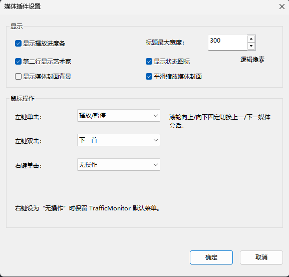

# TrafficMonitorMedia

TrafficMonitorMedia 是一个适用于 [TrafficMonitor](https://github.com/zhongyang219/TrafficMonitor) 的 Windows 媒体信息插件，用于在任务栏窗口中显示当前媒体并提供常用播放控制。

最新版本：**1.0.3**

## 截图 (v1.0.1)

基础展示


基础展示（带背景图片）


插件选项



## 功能

- 显示当前媒体标题。
- 可在第二行显示艺术家；关闭后标题可使用完整文本区域。
- 显示播放、暂停或无媒体状态图标，并可在插件选项中关闭。
- 在标题底部叠绘播放进度，并可关闭进度条；进度条不额外挤占文本高度。
- 可选显示媒体封面背景：封面保持比例、居中裁剪，并使用深色遮罩保证文字可读性；默认启用平滑缩放。
- 提供媒体卡片窗口，集中显示媒体来源、封面、标题、艺术家、播放时间和进度，并提供播放控制、媒体会话切换和进度跳转。
- 左键单击、左键双击和右键单击可分别配置为：
  - 无操作
  - 打开媒体卡片
  - 播放/暂停
  - 上一首
  - 下一首
- 鼠标滚轮可配置为：
  - 无操作
  - 上一首/下一首
  - 上一/下一媒体会话
  - 增减系统音量
- 系统音量增减支持设置步长，默认 4%，范围 1–50%。
- 默认左键单击打开媒体卡片，左键双击播放/暂停，滚轮切换媒体会话，右键无操作。
- 支持深色/浅色任务栏和 DPI 缩放。
- 设置自动保存在 TrafficMonitor 插件配置目录。

## 系统要求

- Windows 10 1809 或更高版本。
- 支持插件功能的 TrafficMonitor。
- 插件 DLL 位数必须与 TrafficMonitor 位数一致。
- 播放器需要支持 Windows Global System Media Transport Controls（GSMTC）。

播放器对 GSMTC 的支持程度不同。部分播放器可能不提供艺术家、播放进度、媒体封面或外部控制能力，这些情况下插件会自动降级显示。

## 安装使用

1. 获取与 TrafficMonitor 位数一致的 `TrafficMonitorMedia.dll`。
2. 将 DLL 复制到 TrafficMonitor 程序目录下的 `plugins` 目录。
3. 重启 TrafficMonitor。
4. 打开 TrafficMonitor 的插件管理，确认 **TrafficMonitorMedia** 已加载。
5. 在任务栏窗口上点击右键，进入显示设置，启用 **媒体标题** 显示项。

> 如果插件加载失败，请首先确认 DLL 和 TrafficMonitor 的架构一致，例如 64 位 TrafficMonitor 必须使用 x64 DLL。

## 默认操作

| 操作 | 功能 |
|---|---|
| 左键单击标题 | 打开媒体卡片 |
| 左键双击标题 | 播放/暂停 |
| 右键单击标题 | 无操作，保留 TrafficMonitor 默认菜单 |
| 滚轮向上 | 多媒体会话时切换到上一会话 |
| 滚轮向下 | 多媒体会话时切换到下一会话 |

默认滚轮动作仍为“上一/下一媒体会话”。如果改为“上一首/下一首”，则滚轮向上为上一首、向下为下一首；如果改为“增减系统音量”，则滚轮向上增大系统主音量、向下减小系统主音量。

## 媒体卡片

媒体卡片用于集中查看和控制当前媒体，显示媒体来源、封面、标题、艺术家和播放进度，并提供切换曲目、播放/暂停、切换媒体会话和调整播放位置等操作。

点击卡片外区域即可关闭。卡片会以简短动画显示和关闭，并且不会干扰自动隐藏任务栏。播放器未提供封面、时间线或某项控制能力时，卡片会自动隐藏或禁用相应内容，其他功能仍可正常使用。

左键单击和左键双击同时配置动作时，双击优先执行，不会额外触发单击动作。

## 插件设置

在 TrafficMonitor 的插件管理或插件菜单中打开 **TrafficMonitorMedia → 插件选项**。选项窗口支持调整大小：显示和鼠标操作采用独立分组，分组内字段按两列紧凑排布；空间不足时内容区域可滚动，确定和取消按钮固定在右下角。

### 显示设置

| 设置项 | 说明 | 默认值 |
|---|---|---|
| 显示播放进度条 | 播放器提供有效时间线时显示标题底部进度；进度条以叠绘方式显示，不额外占用文字高度 | 开启 |
| 显示状态图标 | 显示播放、暂停或无媒体图标 | 开启 |
| 第二行显示艺术家 | 艺术家可用时在第二行显示 | 开启 |
| 显示媒体封面背景 | 播放器提供 GSMTC 缩略图时将封面绘制为当前显示项背景 | 关闭 |
| 平滑缩放媒体封面 | 改善封面缩放后的显示效果，仅在封面背景开启时生效 | 开启 |
| 标题最小宽度 | 设置任务栏显示项的最小宽度，范围为 100–1000 逻辑像素；不会超过标题最大宽度 | 100 |
| 标题最大宽度 | 限制任务栏显示项宽度，范围为 100–1000 逻辑像素；不会小于标题最小宽度 | 400 |

封面背景开启后会自动裁剪并使用深色遮罩，保证文字清晰可读。播放器没有提供封面或图片读取失败时，插件会自动使用原有任务栏背景。

### 鼠标操作

左键单击、左键双击和右键单击均可独立配置为：

- 无操作
- 打开媒体卡片
- 播放/暂停
- 上一首
- 下一首

滚轮动作可配置为：

| 滚轮动作 | 行为 |
|---|---|
| 无操作 | 插件不处理滚轮事件 |
| 上一首/下一首 | 向上滚动上一首，向下滚动下一首 |
| 上一/下一媒体会话 | 向上切换上一媒体会话，向下切换下一媒体会话；只有多个会话时消费事件 |
| 增减系统音量 | 向上增大系统主音量，向下减小系统主音量 |

系统音量步长以百分比设置，默认 4%，有效范围 1–50%。这里控制的是 Windows 当前默认播放设备的系统主音量，不是单个播放器的应用音量。

## 已知限制

- TrafficMonitor V1.86 可能不会为插件分配独占双行区域。文本和封面只能绘制在插件实际获得的矩形内，无法强制占据完整一列。
- TrafficMonitor 插件接口不能控制任务栏窗口的绝对位置，因此无法根据 Windows 任务栏居中或靠左设置重新定位插件。
- GSMTC 没有标准歌词字段，当前版本不支持歌词显示。
- 某些播放器不会完整提供媒体信息、播放时间线、封面或外部控制能力。
- 系统音量控制作用于 Windows 当前默认播放设备；切换输出设备后，下一次音量操作会作用于新的默认设备。

未来功能与详细行为参见 [DESIGN.md](DESIGN.md)。

## 从源码构建

### 环境要求

- Windows
- Visual Studio / MSBuild
- 使用 C++ 的桌面开发工作负载
- MFC 动态库组件
- Windows 10 或更高版本的 Windows SDK
- C++20
- [just](https://github.com/casey/just)（使用仓库内开发命令时需要）

当前工程配置使用 `v145` 平台工具集。如果本机安装的是其他兼容工具集，可在 Visual Studio 工程属性中调整 `Platform Toolset`。

### 构建命令

构建并验证 x64 Release DLL：

```powershell
just check Release x64
```

32 位构建可以使用对外名称 `x86`；脚本内部会映射到 MSBuild/VC++ 的 `Win32` 平台：

```powershell
just check Release x86
```

仅构建 Debug：

```powershell
just build Debug x64
```

Release DLL 输出位置：

```text
TrafficMonitorMedia\bin\x64\Release\TrafficMonitorMedia.dll
```

也可以使用 Visual Studio 打开：

```text
TrafficMonitorMedia.sln
```

TrafficMonitor/PluginTester 中的加载、封面显示和交互测试需要人工执行。

## 项目结构

```text
TrafficMonitorMedia/        插件工程、源代码和资源
include/                    TrafficMonitor 插件接口
assets/mdi/                 插件与状态图标的 SVG 来源文件
scripts/                    构建、验证、工具链定位和资源生成脚本
DESIGN.md                   功能设计、限制和未来功能
CHANGELOG.md                版本更新记录
TrafficMonitorMedia.sln     Visual Studio 解决方案
```

## 图标来源

插件图标与状态图标均来自 [Material Design Icons](https://icon-sets.iconify.design/mdi/)，作者为 Pictogrammers，按 Apache License 2.0 提供。来源记录见 `assets/mdi/SOURCE.txt`。

## 致谢

- [TrafficMonitor](https://github.com/zhongyang219/TrafficMonitor)：插件宿主和插件接口。
- [TrafficMonitorPlugins](https://github.com/zhongyang219/TrafficMonitorPlugins)：官方插件模板与开发参考。
- [Material Design Icons](https://github.com/Templarian/MaterialDesign)：任务栏状态图标。
